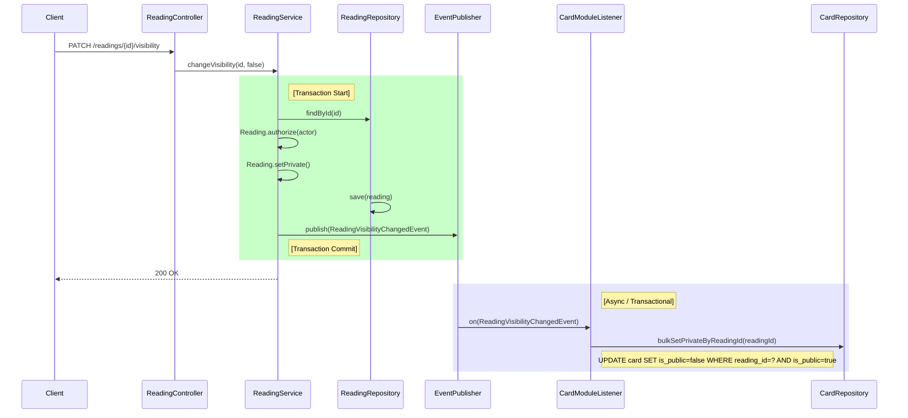
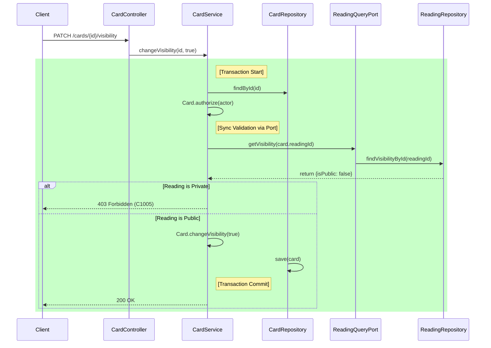
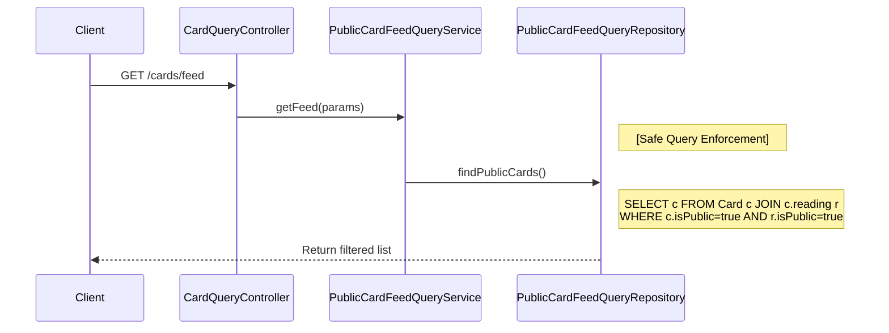
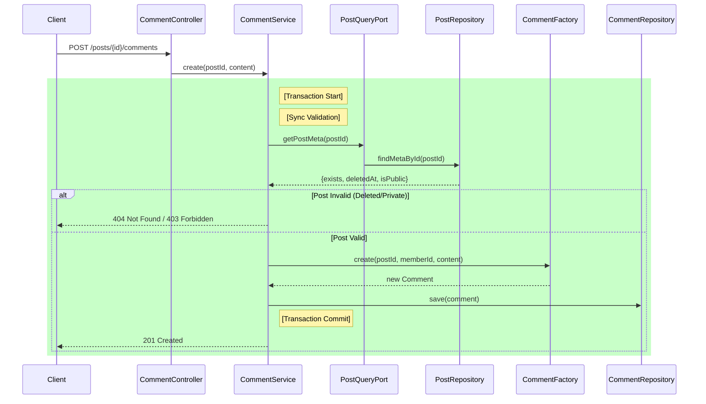
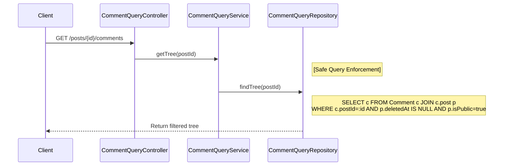

# ADR 시퀀스 다이어그램 및 구현 규칙

본 문서는 **7.2 주요 의사결정 기록 (ADR)**에 명시된 정책(쓰기=동기 검증, 전파=이벤트, 조회=즉시 차단)을 준수하기 위한 **API별 텍스트 시퀀스 다이어그램**과 **강제 구현 규칙**을 정의합니다.

---

## 1. Reading ↔ Card 관계

### 1.1 Reading 비공개 전환 (전파 경로: 최종 일관성)

**정책**: `Reading`이 비공개로 전환되면, 수많은 `Card`를 비공개로 전환하는 것은 **이벤트 기반 비동기 처리**로 진행합니다. (SLO: 99.9% 10초 이내 완료)

**Endpoint**: `PATCH /readings/{readingId}/visibility {isPublic:false}`

### 1.2 Card 공개 전환 (쓰기 경로: 동기 검증)

**정책**: `Reading`이 비공개 상태라면, `Card`를 공개로 설정하는 요청은 **즉시 실패**해야 합니다. (보안 불변식 타협 없음)

**Endpoint**: `PATCH /cards/{cardId}/visibility {isPublic:true}`

### 1.3 공개 카드 피드 조회 (조회 경로: 즉시 차단)

**정책**: 이벤트 전파 지연 중에도 비공개 Reading의 카드가 노출되어서는 안 됩니다. **쿼리 레벨에서 차단**합니다.

**Endpoint**: `GET /cards/feed?scope=public`

---

## 2. Post ↔ Comment 관계

### 2.1 댓글 작성 (쓰기 경로: 동기 검증)

**정책**: `Post`가 비공개이거나 삭제된 경우, 댓글 작성을 차단합니다.

**Endpoint**: `POST /posts/{postId}/comments`

### 2.2 댓글 트리 조회 (조회 경로: 즉시 차단)

**정책**: `Post`가 비공개/삭제되면, 댓글 삭제 이벤트가 돌기 전이라도 **댓글 조회는 즉시 차단**되어야 합니다.

**Endpoint**: `GET /posts/{postId}/comments`

---

## 3. 구현 강제 규칙 (Development Guardrails)

개발자는 다음 3가지 규칙을 반드시 준수해야 합니다.

1.  **쓰기 검증 (Write Validation)**:
    *   `Card` 공개 설정, `Comment` 작성 시에는 반드시 부모(`Reading`, `Post`)의 상태를 **QueryPort**를 통해 동기적으로 확인해야 합니다.
    *   `Entity` 간 직접 참조(`card.getReading().isPublic()`)는 허용되지 않습니다. (Lazy Loading 및 트랜잭션 범위 문제 방지)

2.  **안전한 조회 (Safe Read)**:
    *   공개 데이터 조회(`feed`, `comments`) 시에는 반드시 부모 테이블을 **JOIN**하여 부모의 공개/삭제 상태를 `WHERE` 절에 포함해야 합니다.
    *   단순히 `isPublic=true`만 체크하는 쿼리는 보안 위반으로 간주합니다.

3.  **전파의 책임 (Propagation Responsibility)**:
    *   부모의 상태 변경(`Private` 전환, 삭제)에 따른 자식 데이터 정리는 **도메인 이벤트 리스너**에서 수행합니다.
    *   리스너는 **Idempotent**(멱등성)를 보장해야 하며, 실패 시 재시도 가능해야 합니다.
